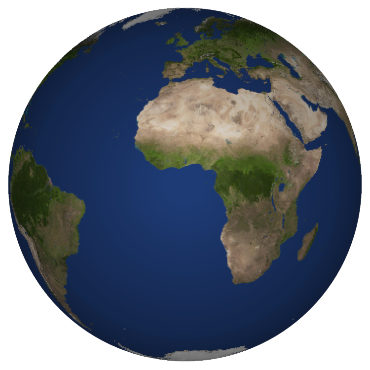
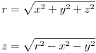
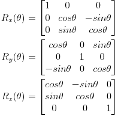
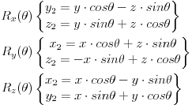
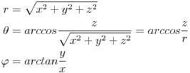
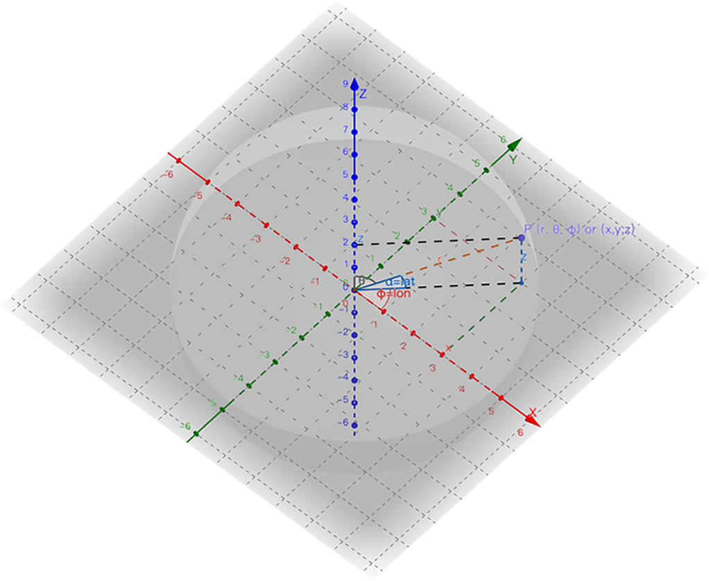
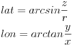
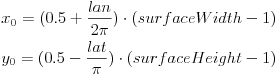
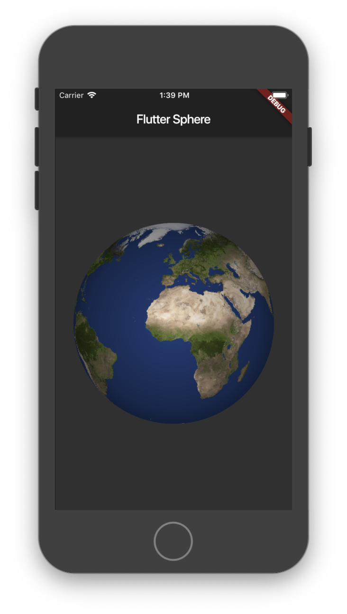

# Flutter 如何制作3D效果的球体


源代码地址：[github.com/zesage/sphere](https://github.com/zesage/sphere)，先看效果图：


在之前使用过 After Effects 的 CC Sphere 插件，很轻松的将一张平面地图转换成3D的地球仪，使用Flutter如何实现这种效果呢？接下来我们来讲如何将下方左边的图片<sup>(surface)</sup>转换为右边的球体<sup>(sphere)</sup>，并实现任意旋转缩放。

<div align="left">


</div>

*<sub>图片来源：[solarsystemscope.com](https://www.solarsystemscope.com/textures/)</sub>*


### 创建 Sphere 部件

------

首先创建一个名称为Sphere的StatefulWidget部件，需要使用到的参数有图片的文件名surface，球体的半径radius，还有中心的经纬度latitude、longitude。

```dart
class Sphere extends StatefulWidget {
  Sphere({Key key, this.surface, this.radius, this.latitude, this.longitude}): super(key: key);
  final String surface;
  final double radius;
  final double latitude;
  final double longitude;

  @override
  _SphereState createState() => _SphereState();
}

class _SphereState extends State<Sphere> {
  @override
  Widget build(BuildContext context) {
    return Container(
      
    );
  }
}
```


### 获取 surface 像素

------

在部件初始化的时候读取并获取图片的所有像素。通过rootBundle读取assets里的图片文件的二进制数据，然后使用decodeImageFromList将二进制数据解码并生成Image对象，最后使用Image.toByteData 即可获取图片的所有像素，完成后使用setState刷新部件。

```dart
import 'dart:typed_data';
import 'dart:ui' as ui;
import 'package:flutter/services.dart' show rootBundle;
... ...
  
class _SphereState extends State<Sphere> {
  Uint32List surface;
  double surfaceWidth;
  double surfaceHeight;

  void loadSurface() {
    rootBundle.load(widget.surface).then((data) {
      ui.decodeImageFromList(data.buffer.asUint8List(), (image) {
        image.toByteData(format: ui.ImageByteFormat.rawRgba).then((pixels) {
          surface = pixels.buffer.asUint32List();
          surfaceWidth = image.width.toDouble();
          surfaceHeight = image.height.toDouble();
          setState(() {});
        });
      });
    });
  }

  @override
  void initState() {
    super.initState();
    loadSurface();
  }
```


### 创建 Sphere 图像

------

球体画到画布上后都是一个圆形，那么如何将画布上的圆形的每个像素点都对应到图片surface上的点呢？首先需要把画布坐标转换为直角坐标，再使用旋转矩阵将坐标旋转指定角度，然后将旋转后到坐标转换为球坐标，最后将球坐标转换为图片上的像素坐标。


- 画布坐标转换为直角坐标，可以通过[球坐标系变换公式](https://en.wikipedia.org/wiki/Spherical_coordinate_system#Cartesian_coordinates)，在已知球体半径 r 和 x、y 即可求出 z 坐标，那么直角坐标则为(x,y,z)，公式：
  <!--  $$
  \begin{aligned}
  r&=\sqrt{x^2+y^2+z^2}\\\\
  z&=\sqrt{r^2-x^2-y^2}
  \end{aligned}
  $$-->
  <div align="center">
  
  </div>

  

- 使用[旋转矩阵](https://en.wikipedia.org/wiki/Rotation_matrix#Basic_rotations)来旋转坐标，公式：
<!--  $$
  \begin{aligned}
  R_x(\theta)&=\begin{bmatrix}1 & 0 & 0 \\ 0 & cos\theta & -sin\theta \\ 0 & sin\theta & cos\theta \end{bmatrix} \\
  R_y(\theta)&=\begin{bmatrix}cos\theta & 0 & sin\theta \\ 0 & 1 & 0 \\ -sin\theta & 0 & cos\theta \end{bmatrix} \\
  R_z(\theta)&=\begin{bmatrix}cos\theta & -sin\theta & 0 \\ sin\theta & cos\theta & 0 \\ 0 & 0 & 1 \end{bmatrix}
  \end{aligned}
  $$-->
  <div align="center">
  
  </div>

  
  
  Rx(θ)是绕x轴旋转θ弧度，是纬度的旋转，Rz(θ)是绕z轴旋转θ弧度，是经度的旋转，Ry(θ)暂时没用到，如(x,y,z)为原坐标，那么旋转后的坐标(x2,y2,z2)计算如下：
  <!--  $$
  \begin{aligned}
  R_x(\theta)&
  \begin{Bmatrix}
  y_2=y\cdot cos\theta - z\cdot sin\theta \\
  z_2=y\cdot sin\theta + z\cdot cos\theta \\
  \end{Bmatrix} \\
R_y(\theta)&
  \begin{Bmatrix}
x_2=x\cdot cos\theta + z\cdot sin\theta \\
  z_2=-x\cdot sin\theta + z\cdot cos\theta \\
  \end{Bmatrix} \\
  R_z(\theta)&
  \begin{Bmatrix}
  x_2=x\cdot cos\theta - y\cdot sin\theta \\
  y_2=x\cdot sin\theta + y\cdot cos\theta
  \end{Bmatrix}
  \end{aligned}
  $$-->
  
  <div align="center">
  
  </div>
  
- 直角坐标转换为球坐标，[球坐标系变换公式](https://en.wikipedia.org/wiki/Spherical_coordinate_system#Cartesian_coordinates)为：
<!--  $$
  \begin{aligned}
  r&=\sqrt{x^2+y^2+z^2}\\
  \theta&=arccos\frac{z}{\sqrt{x^2+y^2+z^2}}=arccos\frac{z}{r}\\
  \varphi&=arctan\frac{y}{x}
  \end{aligned}
  $$-->
  <div align="center">
  
  </div>

  如图在球面上的任意一点P(r, θ, φ)，直角坐标表示为(x,y,z)，经度lon为φ角，而纬度lat并不是θ角，而是θ的邻角，也就是90°-θ。

  

  *<sub>图片来源：[geogebra.org](https://www.geogebra.org/3d/udth5zdd)</sub>*

  

  由此我们可以得出以下公式：
<!--  $$
  \begin{aligned}
  &lat=arcsin\frac{z}{r}\\
  &lon=arctan\frac{y}{x}
  \end{aligned}
  $$-->
  <div align="center">
  
  </div>

- 经纬度转换成图片的像素坐标 

  经度lon范围是 -π～π，纬度lat范围是 -π/2～π/2，将经纬度按比例转换成图片surface上的像素坐标(x0, y0)。

<!--  $$
  x_0=(0.5+\frac{lan}{2\pi})\cdot (surfaceWidth-1)\\
  y_0=(0.5-\frac{lat}{\pi})\cdot (surfaceHeight-1)
  $$-->
  <div align="center">
  
  </div>

了解如何转换坐标后，就可以开始创建Sphere的图像了，我们使用Uint32List类型创建一个Sphere像素表来存储所有像素，然后遍历每个像素，转换其坐标后从surface上获取像素并存入Sphere像素表，完成后使用decodeImageFromPixels 将Sphere像素表转换成Image对象，而转换Image使用的是回调函数，所以这里使用Completer来返回Future<ui.Image>类型。

```dart
import 'dart:async';
import 'dart:math' as math;
... ...
  
class _SphereState extends State<Sphere> {
  ... ...
  Future<ui.Image> buildSphere() {
    if (surface == null) return null;
    final r = widget.radius;
    final minX = -r;
    final minY = -r;
    final maxX = r;
    final maxY = r;
    final width = maxX - minX;
    final height = maxY - minY;
    final sphere = Uint32List(width.toInt() * height.toInt());

    for (var y = minY; y < maxY; y++) {
      for (var x = minX; x < maxX; x++) {
        var z = r * r - x * x - y * y;
        if (z > 0) {
          z = math.sqrt(z);

          var x1 = x, y1 = y, z1 = z;
          double x2, y2, z2;
          //rotate around the X axis
          var angle = math.pi / 2 - widget.latitude * math.pi / 180;
          y2 = y1 * math.cos(angle) - z1 * math.sin(angle);
          z2 = y1 * math.sin(angle) + z1 * math.cos(angle);
          y1 = y2;
          z1 = z2;
          //rotate around the Y axis
          //angle = 0;
          //x2 = x1 * math.cos(angle) + z1 * math.sin(angle);
          //z2 = -x1 * math.sin(angle) + z1 * math.cos(angle);
          //x1 = x2;
          //z1 = z2;
          //rotate around the Z axis
          angle = widget.longitude * math.pi / 180 + math.pi / 2;
          x2 = x1 * math.cos(angle) - y1 * math.sin(angle);
          y2 = x1 * math.sin(angle) + y1 * math.cos(angle);
          x1 = x2;
          y1 = y2;

          final lat = math.asin(z1 / r);
          final lon = math.atan2(y1, x1);

          final x0 = (0.5 + lon / (2.0 * math.pi)) * (surfaceWidth - 1);
          final y0 = (0.5 - lat / math.pi) * (surfaceHeight - 1);

          final color = surface[y0.round() * surfaceWidth.toInt() + x0.round()];
          sphere[((-y - minY - 1) * width + x - minX).toInt()] = color;
        }
      }
    }

    final c = Completer<ui.Image>();
    ui.decodeImageFromPixels(
      sphere.buffer.asUint8List(),
      width.toInt(),
      height.toInt(),
      ui.PixelFormat.rgba8888,
      (image) => c.complete(image),
    );
    return c.future;
  }

```


### 绘制 Sphere 图像

------

由于buildSphere返回的是Future类型，所以使用FutureBuilder来等待图像创建完成后，再使用CustomPaint来绘制，画布的size一般为Sphere半径的两倍，然后为painter属性创建一个继承自CustomPainter的SpherePainter类。

```dart
class _SphereState extends State<Sphere> {
  ... ...
  @override
  Widget build(BuildContext context) {
    return FutureBuilder(
      future: buildSphere(),
      builder: (BuildContext context, AsyncSnapshot<ui.Image> snapshot) {
        return CustomPaint(
          painter: SpherePainter(image: snapshot.data, radius: widget.radius),
          size: Size(widget.radius * 2, widget.radius * 2),
        );
      },
    );
  }
}
```


在SpherePainter的paint方法中进行绘制，先使用clipPath对画布进行圆形裁剪，裁剪半径减去1以便去除圆形周边的锯齿状，再使用drawImage将图像绘制到画布中心，最后使用RadialGradient经向渐变增加立体效果。

```dart
class SpherePainter extends CustomPainter {
  SpherePainter({this.image, this.radius});
  final ui.Image image;
  final double radius;

  @override
  void paint(Canvas canvas, Size size) {
    if (image == null) return;
    final paint = Paint();
    final offset = Offset(size.width / 2, size.height / 2);
    final rect = Rect.fromCircle(center: offset, radius: radius - 1);
    final path = Path()..addOval(rect);
    canvas.clipPath(path);
    canvas.drawImage(image, offset - Offset(radius, radius), paint);

    final gradient = RadialGradient(
      center: Alignment.center,
      colors: [Colors.transparent, Colors.black.withOpacity(0.35), Colors.black.withOpacity(0.5)],
      stops: [0.1, 0.85, 1.0],
    );
    paint.shader = gradient.createShader(rect);
    canvas.drawRect(rect, paint);
  }

  @override
  bool shouldRepaint(CustomPainter oldDelegate) {
    return true;
  }
}
```

[完整代码](https://github.com/zesage/sphere/blob/v0.0.1/lib/sphere.dart)


### 测试 Sphere 部件

------

首先下载一张图片 [2k_earth_daymap.jpg](https://www.solarsystemscope.com/textures/download/2k_earth_daymap.jpg)，再将图片文件添加到assets里，然后在Scaffold的body里添加Sphere部件，代码如下：

```dart
class _MyHomePageState extends State<MyHomePage> {
  @override
  Widget build(BuildContext context) {
    return Scaffold(
      appBar: AppBar(
        title: Text(widget.title),
      ),
      body: Center(
        child: Sphere(
          surface: 'assets/2k_earth_daymap.jpg',
          radius: 180,
          latitude: 0,
          longitude: 0,
        ),
      ),
    );
  }
}
```


运行后效果图：




### 让 Sphere 动起来

------

GestureDetector提供了相当多的手势支持，我们只要onScale事件就可以了，它可以处理拖动、缩放、旋转等手势。在build方法中给FutureBuilder外嵌GestureDetector，在onScaleStart事件中记录当前缩放、旋转和开始拖动的坐标。

```dart
  @override
  Widget build(BuildContext context) {
    return GestureDetector(
      onScaleStart: (ScaleStartDetails details) {
        _lastZoom = zoom;
        _lastRotationX = rotationX;
        _lastRotationZ = rotationZ;
        _lastFocalPoint = details.focalPoint;
      },
```

其中zoom使用的是指数级缩放，缩放后大小是2的zoom次方， rotationX为绕X轴旋转的角度相当于纬度，rotationZ为绕Z轴旋转的角度相当于经度，focalPoint为拖动的坐标。

在onScaleUpdate中，通过details.scale求指数后加上_lastZoom得到当前缩放，将拖动的距离除以缩放后的半径得到拖动的弧度，最后不要忘了刷新部件：

```dart
      onScaleUpdate: (ScaleUpdateDetails details) {
        zoom = _lastZoom + math.log(details.scale) / math.ln2;
        final offset = details.focalPoint - _lastFocalPoint;
        rotationX = _lastRotationX + offset.dy / radius;
        rotationZ = _lastRotationZ - offset.dx / radius;
        setState(() {});
      },
```

让Sphere在拖动后继续旋转一会，onScaleEnd提供了拖动的速度，使用[匀变速直线运动公式](https://en.wikipedia.org/wiki/Acceleration#Uniform_acceleration)，通过加速度a和初始速度v计算旋转持续时间t和距离s，再使用CurveTween的Curves.decelerate实现缓慢减速旋转直至停止。

```dart
      onScaleEnd: (ScaleEndDetails details) {
        final a = -300;
        final v = details.velocity.pixelsPerSecond.dx * 0.3;
        final t = (v / a).abs() * 1000;
        final s = (v.sign * 0.5 * v * v / a) / radius;
        rotationZController.duration = Duration(milliseconds: t.toInt());
        rotationZAnimation = Tween<double>(begin: rotationZ, end: rotationZ + s).animate(CurveTween(curve: Curves.decelerate).animate(rotationZController));
        rotationZController
          ..value = 0
          ..forward();
      },
```

使用动画前还需要给_SphereState添加一个TickerProviderStateMixin。声明变量然后在initState中创建AnimationController，并设置监听以刷新旋转，并在dispose时将其释放，同时添加一个radius属性来获取缩放后的半径。

```dart
class _SphereState extends State<Sphere> with TickerProviderStateMixin {
  double zoom = 0;
  double rotationX = 0;
  double rotationZ = 0;
  double _lastZoom;
  double _lastRotationX;
  double _lastRotationZ;
  Offset _lastFocalPoint;
  AnimationController rotationZController;
  Animation<double> rotationZAnimation;
  double get radius => widget.radius * math.pow(2, zoom);
... ...
  
@override
  void initState() {
    super.initState();
    rotationX = widget.latitude * math.pi / 180;
    rotationZ = widget.longitude * math.pi / 180;
    rotationZController = AnimationController(vsync: this)
      ..addListener(() {
        setState(() => rotationZ = rotationZAnimation.value);
      });
     loadSurface();
  }

  @override
  void dispose() {
    rotationZController.dispose();
    super.dispose();
  }
```


由于增加了缩放所以需要将 build 方法中的半径修改为缩放后的半径

```dart
Widget build(BuildContext context) {
  ... ...
            return CustomPaint(
            //painter: SpherePainter(image: snapshot.data, radius: widget.radius),
            painter: SpherePainter(image: snapshot.data, radius: radius),
            //size: Size(widget.radius * 2, widget.radius * 2),
            size: Size(radius * 2, radius * 2),
            ... ...
```


在 buildSphere 中修改 r 为缩放后的半径，以及将旋转角度改为 rotationX 和 rotationZ。

```dart
  Future<ui.Image> buildSphere() {
    ... ...
    //final r = widget.radius;
    final r = radius.roundToDouble();
    ... ...
          //rotate around the X axis
          //var angle = math.pi / 2 - widget.latitude * math.pi / 180;
          var angle = math.pi / 2 - rotationX;
          ... ...
          //rotate around the Z axis
          //angle = widget.longitude * math.pi / 180 + math.pi / 2;
          angle = rotationZ + math.pi / 2;
          ... ...
```

[完整代码](https://github.com/zesage/sphere/blob/v0.0.2/lib/sphere.dart)

运行后效果图：


------

Sphere widget 已经提交到 [Pub](https://pub.dev/packages/sphere) 上，在你的 pubspec.yaml 中的依赖项添加 sphere 就可以使用该部件了。

```yaml
dependencies:
  sphere: ^0.0.3
```

